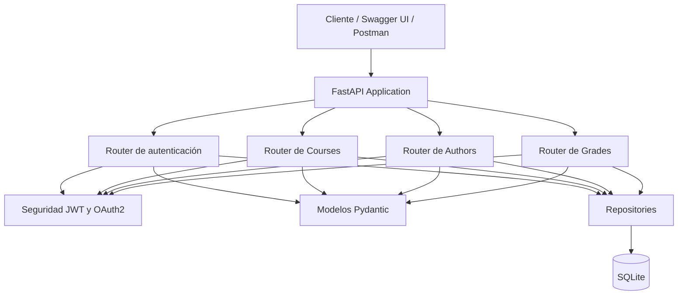

# Arquitectura del proyecto

Course Info API utiliza una arquitectura organizada por responsabilidades.

## Componentes

### FastAPI Application

La aplicación principal registra los routers, configura OpenAPI y administra el ciclo de vida de la base de datos.

### Routers

Los routers exponen los endpoints REST:

- Authentication
- Courses
- Authors
- Grades

### Models

Los modelos Pydantic validan los datos de entrada y salida.

### Repositories

Los repositories encapsulan las operaciones realizadas sobre SQLite.

### Security

El módulo de seguridad administra:

- Hash de contraseñas.
- Validación de credenciales.
- Creación de tokens JWT.
- Validación de tokens.
- Obtención del usuario autenticado.

### Database

SQLite almacena:

- Cursos.
- Autores.
- Calificaciones.
- Usuarios.