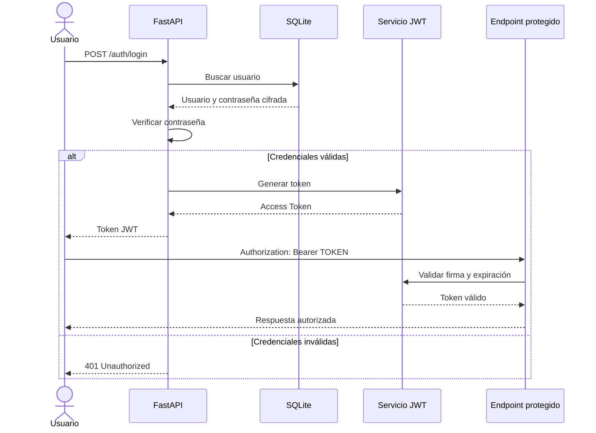

# Flujo de autenticación JWT

## Etapas

1. El usuario se registra mediante `/auth/register`.
2. La contraseña se almacena utilizando un hash Argon2.
3. El usuario envía sus credenciales a `/auth/login`.
4. La API verifica las credenciales.
5. La API genera un token JWT con tiempo de expiración.
6. El usuario envía el token como Bearer Token.
7. La API valida la firma y expiración.
8. El endpoint protegido permite o rechaza el acceso.